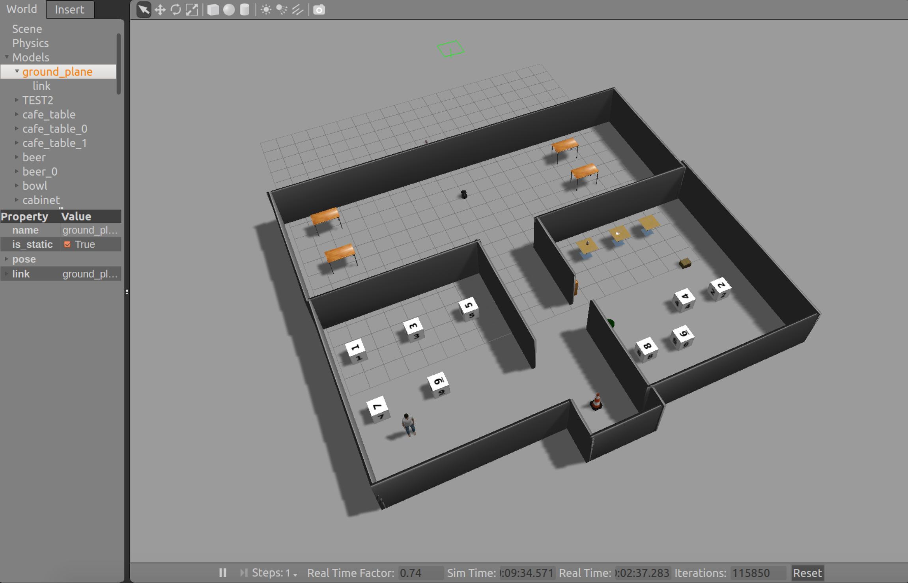
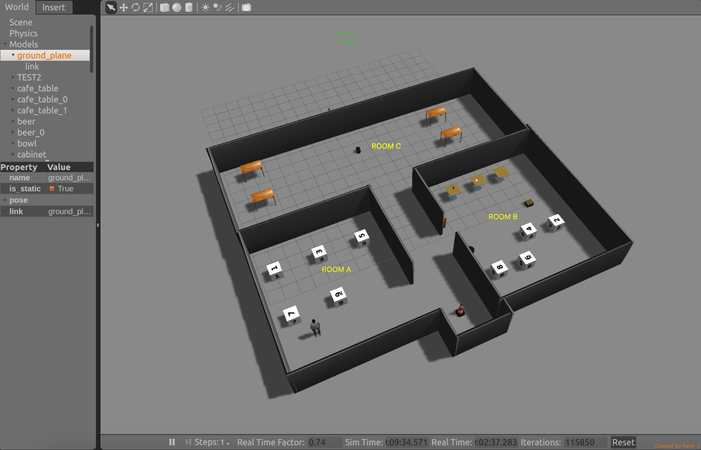

# Service Robot
[](https://travis-ci.org/StevieG47/Service-Robot)
[](https://coveralls.io/github/StevieG47/Service-Robot?branch=master)

## Overview
This is an indoor service robot project which can take simple voice commands from the end user, and navigate autonomously to perform a required task. This indoor service robot is implemented in ROS Gazebo simulation environment using the TurtleBot as the base platform. A custom global planner was written as a plugin, and uses the A* algorithm for planning. SLAM was done on the environment to get a map for navigation. 

## Authors
- Steven Gambino
- Huei-Tzu (Jane) Tsai

## License
MIT open-source license, see [LICENSE.TXT](https://github.com/StevieG47/Service-Robot/blob/master/LICENSE.txt)

The plugin for the global planner was based on the tutorial seen [here](http://wiki.ros.org/navigation/Tutorials/Writing%20A%20Global%20Path%20Planner%20As%20Plugin%20in%20ROS), which is under GNU GPL license. The planner was edited for this project.

## Link to AIP Sheet
[Team Agile Iterative Process](https://docs.google.com/spreadsheets/d/1iFT3fMAvNtwBAL32Rg6VP-Avbg5zfWhtl9Rwo7dgiHw/edit#gid=1455614482)

## Link to notes
[Sprint Planning Notes and Review](https://docs.google.com/document/d/1rKvWalXGmUbCn-tPqvxoK4kGyR2MJIU4lqQ_D-8Y_HA/edit)

## Link to presentation
[Presentation slides](https://docs.google.com/presentation/d/1fSIc1fDiJS7xrZlfU-FcvuNDmx4tRF_PqWEDvJAnYNs/edit#slide=id.p)

## Dependencies
- Ubuntu 14.04
- ROS indigo
- TurtleBot_Gazebo
- Package Dependencies
    - roscpp
    - std_msgs
    - message_generation
    - geometry_msgs
    - move_base_msgs
    - pocketsphinx
    - sound_play
    - actionlib
    - actionlib_msgs
    - nav_msgs
    - nav_core
    - base_local_planner
    - tf
    - rostest
    - rosbag

## Build

```bash
$ mkdir -p ~/catkin_ws/src
$ cd ~/catkin_ws/src
$ catkin_init_workspace
$ git clone --recursive https://github.com/StevieG47/Service-Robot.git
$ cd ~/catkin_ws/
$ catkin_make
```

## Run/Demo

```bash
$ cd ~/catkin_ws
$ source ./devel/setup.bash
$ roslaunch servicebot servicebot_demo.launch
```

This will launch pocketsphinx recognition node, sound_play node, servicebot node, as well as turtlebot in Gazebo simulation.
You should see output similar to below:



ServiceBot accepts voice commands or commands from console.

To control servicebot using voice commands, make sure microphone is working on your PC/notebook.
You will get the best speech recognition results using a headset microphone.

1. Info Query

    - To query name

        Voice:
        "What is your name"

        Console:
        ```bash
        $ cd ~/catkin_ws
        $ source ./devel/setup.bash
        $ rosservice call /commandService "what is your name" ""
        ```

        Output:
        You should hear robot says "My name is servicebot".

    - To query time

        Voice:
        "What time is it"

        Console:
        ```bash
        $ cd ~/catkin_ws
        $ source ./devel/setup.bash
        $ rosservice call /commandService "what time is it" ""
        ```

        Output:
        You should hear robot says "Time now is xx xx am/pm".

2. Play Music
    - To play demo music

        Voice:
        "play music"

        Console:
        ```bash
        $ cd ~/catkin_ws
        $ source ./devel/setup.bash
        $ rosservice call /commandService "play music" ""
        ```

        Output:
        You should hear demo music from PC

    - To play music from file

        Voice:
        (not supported)

        Console:
        ```bash
        $ cd ~/catkin_ws
        $ source ./devel/setup.bash
        $ rosservice call /commandService "play music" "<absolute path of music file on PC>"
        ```
        Output:
        You should hear demo music from PC

    - To stop playing music

        Voice:
        "stop music"

        Console:
        ```bash
        $ cd ~/catkin_ws
        $ source ./devel/setup.bash
        $ rosservice call /commandService "stop music" ""
        ```

        Output:
        You should hear music stop playing on PC

        Note:
        If you are playing music with speaker and using internal mic for voice commands, "stop music" will not work due to lack of AEC feature 
        in servicebot.  Try to use headset mic instead to test with this command.

3. Navigation
    - To navigate servicebot

        You can command servicebot to go to room A, B, C in the world below.

        

        Voice:  
  
        "move to room a"    OR  
        "move to room b"    OR  
        "move to room c"    OR  
        "stop moving"

        Console:
        ```bash
        $ cd ~/catkin_ws
        $ source ./devel/setup.bash
        $ rosservice call /commandService "move to" "room a"
        ```
        OR

        ```bash
        $ rosservice call /commandService "move to" "room b"
        ```
        OR

        ```bash
        $ rosservice call /commandService "move to" "room c"
        ```
        OR

        ```bash
        $ rosservice call /commandService "stop moving" ""
        ```

        Output:
        You should see turtlebot in Gazebo moving to room A, B, C, or stop moving as requested.

    - To move servicebot

        You can command servicebot to move forward, backward, turn left, turn right, or stop.

        Voice:  
  
        "move forward"    OR  
        "move backward"   OR  
        "turn left"       OR  
        "turn right"      OR  
        "stop"

        Console:
        ```bash
        $ cd ~/catkin_ws
        $ source ./devel/setup.bash
        $ rosservice call /commandService "move forward" ""
        ```
        OR

        ```bash
        $ rosservice call /commandService "move backward" ""
        ```
        OR

        ```bash
        $ rosservice call /commandService "turn left" ""
        ```
        OR

        ```bash
        $ rosservice call /commandService "turn right" ""
        ```
        OR

        ```bash
        $ rosservice call /commandService "stop" ""
        ```

        Output:
        You should see turtlebot in Gazebo moving forward, backward, turn left, turn right, or stop as requested.


## Test - rostest

Level 1/2 test implemented can be run as follow:

To build and run the test:

```bash
cd ~/catkin_ws
source ./devel/setup.bash
catkin_make run_tests
```


## Record - rosbag

Servicebot launch file supports recording topics in Gazebo simulation (except /camera/*).  This can be
done by specifying "enable_record" argument. By default, recording is disabled.

To enable rosbag recording:

```bash
cd ~/catkin_ws
source ./devel/setup.bash
roslaunch servicebot servicebot_demo.launch enable_record:=true
```

To inspect rosbag recording result:

```bash
cd ~/.ros/
rosbag info session.bag
```

## Known Issues

1. Voice Commands

    - There is no AEC or NS module in servicebot now so the voice recognition rate could be low.
Try to use headset microphone to receive the best performance of voice recognition.

    - Only words in language model database provided to Pocketsphinx can be recognized.  Yet, the language model 
database we have generated for this project is small so it could not recognize arbitrary music paths.  It could also 
detect voice commands erroneously since Pocketsphinx tries to match the voice captured to the words in database and 
because database is small, unwanted actions could be triggered.

2. Navigation

    - A global planner was written as a plugin to use a custom A* algorithm. This replaces the default global planner. The local DWA planner has issues with dynamic obstacles with this global planner. 

    - Assumes a map of the environment is known. Mapping was done previously for this environment, so for a new world the same will have to be done. 
## Developer Documentation

[Doxygen Document](http://htmlpreview.github.io/?https://github.com/StevieG47/Service-Robot/blob/master/docs/html/index.html)
